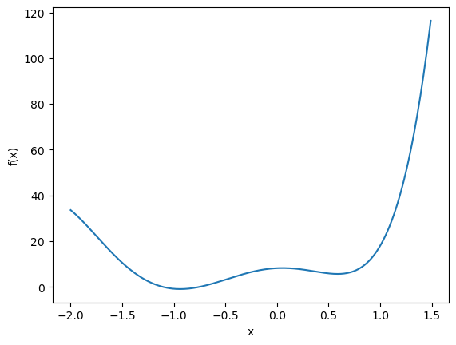
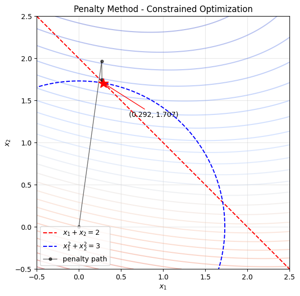

# Exam Scope

## Scope of Examination

**Lec1 – Lec12**

- Projected Gradient Descent is **NOT** included
- Definition of a convex set **IS** included

## Exam Logistics

| Item | Detail |
|------|--------|
| Date | March 17, 2026 |
| Time | 7:30 PM – 9:30 PM (2 hours) |
| Location | Bloomberg 081 |
| Format | Paper and pencil, 3 problems (each with parts A and B, but not C) |
| Allowed materials | Lecture notes as prepared in class **OR** professor's posted handwritten notes (**not both**). No additional notes, no homework solutions, no outside work. |
| iPad notes | Must be printed; iPads not allowed during exam |
| Calculator | Non-communicating calculator allowed, but numbers will be easy enough without one |

# Course Content Review (Lec 1–12)

本章按 Lecture 顺序复习 ORIE 5320 的全部课程内容（Lec 1–12）。每个 Lecture 开头标注其覆盖的考点编号。考点内容用 📌 标记，非考点内容用 [非考点] 标记。

---

## Lecture 1 — ML/AI Optimization & Logistic Regression

> [非考点 · 背景知识] 本讲建立优化问题的基本框架，并引入机器学习中的优化动机。

### 1.1 优化问题的基本形式

一个优化问题由三个要素组成：**决策变量 (decision variables)**、**目标函数 (objective function)**、**约束 (constraints)**。

**Box Optimization 例子：** 设计一个无顶正方形底面盒子，底面边长 $x$，高 $y$，使体积最大且表面积不超过 500 cm²：

$$\max \quad x^2 y$$

$$\text{s.t.} \quad x^2 + 4xy \leq 500, \quad x \geq 0, \quad y \geq 0$$

最优解 $(\hat{x}, \hat{y}) = (12.91, 6.45)$，最优体积 $1075.82$。

**关键观察：** 非线性优化问题中，优化软件可能轻易失败（如初始猜测 $x=0, y=0$ 时 Excel 求解失败）。

### 1.2 ML/AI 中的优化

数据集 $\lbrace(x_j, y_j) : j = 1, \ldots, M\rbrace$，其中 $x_j \in \mathbb{R}^n$ 是特征向量，$y_j \in \mathbb{R}$ 是标签。

目标：找到参数化预测函数 $\phi(\cdot, w): \mathbb{R}^n \to \mathbb{R}$，使得 $\phi(x_j, w) \approx y_j$。

ML/AI 中的通用优化问题：

$$\min_{w \in \mathbb{R}^p} \frac{1}{M} \sum_{j=1}^{M} \ell(x_j, y_j, w)$$

### 1.3 Least Squares, Ridge, Lasso

- **Least Squares:** $\min_{w} \frac{1}{M} \sum_{j=1}^{M} (w^{\top} x_j - y_j)^2$

- **Ridge Regression:** $\min_{w} \frac{1}{M} \sum_{j=1}^{M} (w^{\top} x_j - y_j)^2 + \lambda \lVert w \rVert_2^2$
  - 避免过拟合，增强对 outlier 的鲁棒性

- **Lasso:** $\min_{w} \frac{1}{M} \sum_{j=1}^{M} (w^{\top} x_j - y_j)^2 + \lambda \lVert w \rVert_1$
  - 用于特征选择

### 1.4 Logistic Regression

二分类问题，$y_j \in \lbrace+1, -1\rbrace$，预测函数：

$$\phi(x, w) = \frac{1}{1 + e^{w^{\top} x}}$$

- $\phi(x,w)$ 解释为属于 $+1$ 类的概率
- $1 - \phi(x,w) = \frac{e^{w^{\top} x}}{1 + e^{w^{\top} x}}$ 为属于 $-1$ 类的概率

**最大似然估计（MLE）：** 数据集的似然函数：

$$L(w) = \prod_{j=1}^{M} \left(\frac{1}{1 + e^{w^{\top} x_j}}\right)^{\mathbf{1}(y_j=+1)} \left(\frac{e^{w^{\top} x_j}}{1 + e^{w^{\top} x_j}}\right)^{\mathbf{1}(y_j=-1)}$$

---

## Lecture 2 — Multi-class Logistic Regression & Deep Learning Intro

> [非考点 · 背景知识] 从二分类推广到多分类，并引入深度学习。

### 2.1 对数似然推导

取对数得到：

$$\ln L(w) = -\sum_{j=1}^{M} \ln(1 + e^{w^{\top} x_j}) + \sum_{j=1}^{M} \mathbf{1}(y_j = -1) \cdot w^{\top} x_j$$

最大化问题：

$$\max_{w \in \mathbb{R}^n} \left\lbrace -\sum_{j=1}^{M} \ln(1 + e^{w^{\top} x_j}) + \sum_{j=1}^{M} \mathbf{1}(y_j = -1) \cdot w^{\top} x_j \right\rbrace$$

### 2.2 Multi-class Logistic Regression

$K$ 类分类，$y_j \in \lbrace 1, 2, \ldots, K\rbrace$。Softmax 预测函数：

$$\phi_k(x_j, w_1, \ldots, w_K) = \frac{e^{w_k^{\top} x_j}}{\sum_{\ell=1}^{K} e^{w_\ell^{\top} x_j}}$$

对数似然：

$$\ln L(w_1, \ldots, w_K) = \sum_{j=1}^{M} \sum_{k=1}^{K} \mathbf{1}(y_j = k) \, w_k^{\top} x_j - \sum_{j=1}^{M} \ln\left(\sum_{\ell=1}^{K} e^{w_\ell^{\top} x_j}\right)$$

### 2.3 Deep Learning 引入

$L$ 层神经网络，每层参数 $(Q^\ell, g^\ell)$：

$$a_j^1 = \sigma_1(Q^1 x_j + g^1), \quad a_j^2 = \sigma_2(Q^2 a_j^1 + g^2), \quad \ldots, \quad a_j^L = \sigma_L(Q^L a_j^{L-1} + g^L)$$

维度：$Q^\ell \in \mathbb{R}^{d_\ell \times d_{\ell-1}}$（$d_0 = n$），$g^\ell \in \mathbb{R}^{d_\ell}$。

激活函数：Sigmoid $\sigma(t) = \frac{1}{1+e^t}$，ReLU $\sigma(t) = \max\lbrace t, 0\rbrace$。

整体表达式：

$$z(x_j, Q^1, g^1, \ldots, Q^L, g^L) = \sigma_L\left(Q^L \, \sigma_{L-1}\left(\ldots \sigma_2\left(Q^2 \, \sigma_1(Q^1 x_j + g^1) + g^2\right) \ldots \right) + g^L\right)$$

---

## Lecture 3 — Deep Learning (Continued) & Gradient Descent Basics

> 📌 **考点 1: High level description of gradient descent idea**
>
> [非考点] 深度学习的 MLE 框架（续）

### 3.1 [非考点] 深度学习的最大似然优化

将神经网络输出 $z_j = z(x_j, Q^1, g^1, \ldots, Q^L, g^L)$ 作为 softmax 的输入特征：

$$\max \left\lbrace -\sum_{j=1}^{M} \ln\left(\sum_{\ell=1}^{K} e^{w_\ell^{\top} z_j}\right) + \sum_{j=1}^{M} \sum_{k=1}^{K} \mathbf{1}(y_j = k) \, w_k^{\top} z_j \right\rbrace$$

优化变量为所有层的参数 $(Q^1, g^1, \ldots, Q^L, g^L, w_1, \ldots, w_K)$。

### 3.2 📌 梯度的定义

设 $f: \mathbb{R}^n \to \mathbb{R}$，$f$ 在点 $x^0$ 处的**梯度** (gradient) 为：

$$\nabla f(x^0) = \left(\frac{\partial f(x)}{\partial x_1}\bigg|_{x=x^0}, \; \frac{\partial f(x)}{\partial x_2}\bigg|_{x=x^0}, \; \ldots, \; \frac{\partial f(x)}{\partial x_n}\bigg|_{x=x^0}\right)$$

### 3.3 📌 梯度下降的核心思想

- 沿梯度方向走小步 → 函数值**增大**
- 沿**负**梯度方向走小步 → 函数值**减小**

如果步长 $\alpha$ 足够小：

$$f(x^0 - \alpha \nabla f(x^0)) \leq f(x^0)$$

GD 更新规则：

$$x^{k+1} = x^k - \alpha^k \nabla f(x^k)$$

### 3.4 📌 数值例子

$f(x) = x_1^2 + 4x_1 x_2 + 3x_2^2 - 5$，$\nabla f(x) = (2x_1 + 4x_2, \; 4x_1 + 6x_2)^{\top}$

从 $x^0 = (1, 1)^{\top}$ 出发：$\nabla f((1,1)^{\top}) = (6, 10)^{\top}$

- **步长 $\alpha = 0.1$（合适）：** 新点 $(1,1)^{\top} - 0.1(6,10)^{\top} = (0.4, 0)^{\top}$。$f(x^0) = 3 \geq -4.84 = f(0.4, 0)$ ✓

- **步长 $\alpha = 0.5$（过大）：** 新点 $(1,1)^{\top} - 0.5(6,10)^{\top} = (-2, -4)^{\top}$。$f(x^0) = 3 \ngeq 79 = f(-2,-4)$ ✗ 过冲！

**关键教训：** 步长太大会导致过冲 (overshoot)，函数值反而增大。

---

# Typical Exam Questions

## Code & Excel

### Bisection and Golden Section Search

#### Bisection Search

**Target function:** $f(x) = 6.4x^5 + 20x^4 + 0.9x^3 - 19.6x^2 + 2.1x + 8.2$

```python
import numpy as np
from matplotlib import pyplot as plt

def function(x):
    ## this computes the target function in question 1
    return 6.4 * x**5 + 20 * x**4 + 0.9 * x **3 - 19.6 * x**2 + 2.1 * x + 8.2

def bisection_search(func, a, b, eps, theta):
    ## This function implements a binary search .
    ## func: the target function
    ## a, b: the initial search interval
    ## eps: the perturbation parameter used for comparison
    ## theta: the stopping tolerance on the interval length
    k = 0
    while np.abs(b - a) > theta:
        mid = (a + b)/2
        lam, rho = mid - eps, mid + eps
        f_lam, f_rho = func(lam), func(rho)
        print(f"Iter {k}: [{a:.6f}, {b:.6f}] | lambda ={lam:.6f}, rho={rho:.6f} "
              f"| f(lambda)={f_lam:.6f}, f(rho)={f_rho:.6f}")
        if f_lam <= f_rho:
            b = rho
        else:
            a = lam
        k += 1
    return (a + b)/2
```

**Results (interval $[-2, 1]$):**

```
Local minimum at x = -0.936, objective value = -0.9221429421238625
```

**Results (interval $[-1.25, 2]$):**

```
Local minimum at x = 0.588, objective value = 5.681785651717276
```

**Plot:**



**Discussion:** The function has at least two local minima: one near $x \approx -0.94$ and another near $x \approx 0.59$. The minimum near $-0.94$ has a smaller objective value and is therefore the better minimum. The bisection search method may converge to different local minima depending on the initial interval.

#### Golden Section Search

```python
def golden_section_search(func, a, b, theta):
    ## This function implements the golden section search
    ## func: the target function
    ## a, b: the initial search interval
    ## theta: the stopping tolerance on the interval length
    beta = (-1 + np.sqrt(5))/2
    k = 0
    lam = beta * a + (1-beta) * b
    rho = (1-beta) * a + beta * b
    f_lam, f_rho = func(lam), func(rho)
    while np.abs(b - a) > theta:
        print(f"Iter {k}: [{a:.6f}, {b:.6f}] | lambda ={lam:.6f}, rho={rho:.6f} "
              f"| f(lambda)={f_lam:.6f}, f(rho)={f_rho:.6f}")
        if f_lam <= f_rho:
            # Update interval
            b = rho
            rho = lam
            lam = beta * a + (1-beta) * b
            # Update function value
            f_rho = f_lam
            f_lam = func(lam)
        else:
            # Update interval
            a = lam
            lam = rho
            rho = (1-beta) * a + beta * b
            # Update function value
            f_lam = f_rho
            f_rho = func(rho)
        k += 1
    return (a+b)/2
```

**Results:**

```
Local minimum at x = -0.938, objective value = -0.9222264671231972
```

---

### Gradient Descent

#### Gradient Descent with Bisection Line Search

**Function:** $f(x_1, x_2) = (x_1 - 4x_2 + 4)^2 + (x_1 + 3x_2 + 2)^4$

**Gradient:**

$$\nabla f(x_1, x_2) = \begin{pmatrix} 2(x_1 - 4x_2 + 4) + 4(x_1 + 3x_2 + 2)^3 \\ -8(x_1 - 4x_2 + 4) + 12(x_1 + 3x_2 + 2)^3 \end{pmatrix}$$

```python
import numpy as np

def function(x):
    ## this computes the target function in question 1
    x1, x2 = x[0], x[1]
    return (x1 - 4 * x2 + 4)**2 + (x1 + 3 * x2 + 2)**4

def gradient(x):
    ## this computes the gradient of the target function
    x1, x2 = x[0], x[1]
    g1 = 2 * (x1 - 4 * x2 + 4) + 4 * (x1 + 3 * x2 + 2)**3
    g2 = -8 * (x1 - 4 * x2 + 4) + 12 * (x1 + 3 * x2 + 2)**3
    return np.array([g1, g2])

def bisection_search(func, a, b, eps, theta, max_iter=1000):
    ## This function implements a binary search for step size
    ## func: the one-dimensional function along the search direction
    ## a, b: the initial search interval
    ## eps: the perturbation parameter used for comparison
    ## theta: the stopping tolerance on the interval length
    k = 0
    while np.abs(b - a) > theta and k < max_iter:
        mid = (a + b) / 2
        lam, rho = mid - eps, mid + eps
        f_lam, f_rho = func(lam), func(rho)
        if f_lam <= f_rho:
            b = rho
        else:
            a = lam
        k += 1
    return (a + b) / 2

def gradient_descent(x0, eps, theta, max_iter = 1000):
    ## This function implements gradient descent with bisection line search
    ## x0: initial point
    ## eps, theta: parameters for bisection search
    ## max_iter: maximum number of iterations for gradient descent
    x = np.array(x0, dtype=float)
    for k in range(max_iter):
        f_val = function(x)
        print(f"Iter {k}: x = {x}, f(x) = {f_val:.10f}")
        g = gradient(x)
        if np.linalg.norm(g) <= 1e-8:
            break
        d = -g
        def line_function(alpha):
            return function(x + alpha * d)
        alpha_star = bisection_search(
            line_function, 0, 1, eps, theta
        )
        x = x + alpha_star * d
    return x
```

**Results:** Starting from $(1, 1)$ with $\epsilon = 10^{-4}$, $\theta = 10^{-5}$:

```
x = [-2.84263012  0.28933933], f(x) = 4.16e-07
```

**Analytical verification:** The function is a sum of two nonnegative terms: $(x_1 - 4x_2 + 4)^2 \geq 0$ and $(x_1 + 3x_2 + 2)^4 \geq 0$. Hence $f(x_1, x_2) \geq 0$ for all $(x_1, x_2) \in \mathbb{R}^2$. The minimum value is 0, attained when $x_1 - 4x_2 + 4 = 0$ and $x_1 + 3x_2 + 2 = 0$. Solving: $x^{\ast} = \left(-\frac{20}{7}, \frac{2}{7}\right)$, $f(x^{\ast}) = 0$.

---

### Penalty Function Method

#### Penalty Function Method

**Problem:** Minimize $f(x) = (x_1 - 2)^2 + 2(x_2 - 4)^2 + x_1 x_2$ subject to $g_1(x) = x_1 + x_2 - 2 \leq 0$, $g_2(x) = x_1^2 + x_2^2 - 3 \leq 0$.

**Part (a): Code**

```python
import numpy as np

# objective f(x)
def function(x):
    x1, x2 = x[0], x[1]
    return (x1 - 2)**2 + 2*(x2 - 4)**2 + x1*x2

def gradient(x):
    x1, x2 = x[0], x[1]
    dfdx1 = 2*(x1 - 2) + x2
    dfdx2 = 4*(x2 - 4) + x1
    return np.array([dfdx1, dfdx2])

# constraints: g_i(x) <= 0
def constraint1(x):
    return x[0] + x[1] - 2
def constraint1_grad(x):
    return np.array([1.0, 1.0])
def constraint2(x):
    return x[0]**2 + x[1]**2 - 3
def constraint2_grad(x):
    return np.array([2*x[0], 2*x[1]])
```

```python
# penalized objective
def penalized_obj(x, th1, th2):
    val = function(x)
    g1 = constraint1(x)
    g2 = constraint2(x)
    val += th1 * (max(0, g1))**2 + th2 * (max(0, g2))**2
    return val

def penalized_gradient(x, th1, th2):
    gr = gradient(x).copy()
    g1 = constraint1(x)
    g2 = constraint2(x)
    # from the hint: d/dx (max{0,g(x)})^2 = 2*g(x)*dg/dx if g(x)>0, else 0
    if g1 > 0:
        gr += th1 * 2 * g1 * constraint1_grad(x)
    if g2 > 0:
        gr += th2 * 2 * g2 * constraint2_grad(x)
    return gr
```

```python
def gd_minimize(x0, th1, th2, maxiter=10000, tol=1e-10):
    x = x0.copy()
    for _ in range(maxiter):
        g = penalized_gradient(x, th1, th2)
        # backtracking to pick step size, otherwise blows up for big theta
        lr = 1.0
        fval = penalized_obj(x, th1, th2)
        for __ in range(50):
            xtry = x - lr * g
            if penalized_obj(xtry, th1, th2) < fval - 1e-12 * lr * np.dot(g, g):
                break
            lr *= 0.5
        xnew = x - lr * g
        if np.linalg.norm(xnew - x) < tol:
            break
        x = xnew
    return x
```

```python
def penalty_method(x0, theta_init=10.0, scale=10.0, max_outer=12):
    th = theta_init
    x = x0.copy()
    prev_x = x.copy()

    print(f"{'Iter':>4}  {'x1':>10}  {'x2':>10}  {'f(x)':>12}  {'h(x)':>12}  {'g1(x)':>10}  {'g2(x)':>10}")
    print("-" * 82)

    for k in range(1, max_outer + 1):
        x = gd_minimize(x, th, th)
        fval = function(x)
        hval = penalized_obj(x, th, th)
        g1val = constraint1(x)
        g2val = constraint2(x)
        print(f"{k:4d}  {x[0]:10.6f}  {x[1]:10.6f}  {fval:12.6f}  {hval:12.6f}  {g1val:10.6f}  {g2val:10.6f}")

        # stop when solution stops moving
        if k > 1 and np.linalg.norm(x - prev_x) < 1e-5:
            print(f"\nConverged at outer iteration {k}.")
            break

        prev_x = x.copy()
        th *= scale

    print(f"\nSolution: x = ({x[0]:.6f}, {x[1]:.6f})")
    print(f"Objective value: f(x) = {function(x):.6f}")
    print(f"g1(x) = x1+x2-2 = {constraint1(x):.12f}")
    print(f"g2(x) = x1^2+x2^2-3 = {constraint2(x):.10f}")
    return x
```

```python
x_init = np.array([0.0, 0.0])
x_sol = penalty_method(x_init)
```

**Output:**

```
Iter        x1        x2        f(x)        h(x)     g1(x)     g2(x)
----------------------------------------------------------------------------------
   1    0.274724    1.744780    13.627947    13.775103    0.019503    0.119730
   2    0.289955    1.711290    13.896839    13.912837    0.001245    0.012587
   3    0.292581    1.707531    13.925696    13.927314    0.000112    0.001267
   4    0.292862    1.707149    13.928608    13.928770    0.000011    0.000127
   5    0.292890    1.707111    13.928900    13.928916    0.000001    0.000013
   6    0.292893    1.707107    13.928929    13.928931    0.000000    0.000001

Converged at outer iteration 6.

Solution: x = (0.292893, 1.707107)
Objective value: f(x) = 13.928929
g1(x) = x1+x2-2 = 0.000000110386
g2(x) = x1^2+x2^2-3 = 0.0000012677
```

**Converged solution:** $x^{\ast} \approx (0.2929, 1.7071)$, $f(x^{\ast}) \approx 13.929$. Both constraints are active at the solution ($g_1(x) \approx 0$, $g_2(x) \approx 0$).

**Convergence visualization:**



**Part (c): Excel Solver Verification**

Excel Solver (GRG Nonlinear / 非线性 GRG) setup:
- Decision variables: $x_1, x_2$ (cells B1:B2, starting from 0)
- Objective cell: B4 = `=(B1-2)^2 + 2*(B2-4)^2 + B1*B2` → minimize
- Constraints: `B5 <= 0` ($x_1 + x_2 - 2 \leq 0$) and `B6 <= 0` ($x_1^2 + x_2^2 - 3 \leq 0$)


**Excel result:** $x_1 = 0.2929$, $x_2 = 1.7071$, $f = 13.929$

This matches the penalty method result. Both find the same optimum at the intersection of the two constraint boundaries.

---

## Deduction Problem

### Taylor's Theorem

#### Proof that $h(x, y) = o(\lVert y - x \rVert)$

Let $f(x) = x^3 + 4x^2 + 5x + 1$. Then $f'(x) = 3x^2 + 8x + 5$.

Define $h(x, y) = f(y) - f(x) - f'(x)(y - x)$.

**Goal:** Show that $h(x, y) = o(\lVert y - x \rVert)$.

**Proof:** First, expand $f(y) - f(x)$:

$$f(y) - f(x) = (y^3 - x^3) + 4(y^2 - x^2) + 5(y - x)$$

Using the standard factorizations $y^3 - x^3 = (y - x)(y^2 + xy + x^2)$ and $y^2 - x^2 = (y - x)(y + x)$:

$$f(y) - f(x) = (y - x)(y^2 + xy + x^2) + 4(y - x)(y + x) + 5(y - x)$$

Substituting into $h(x, y)$:

$$h(x, y) = (y - x)(y^2 + xy + x^2 + 4y + 4x + 5) - (3x^2 + 8x + 5)(y - x)$$

Factoring out $(y - x)$:

$$h(x, y) = (y - x)\left(y^2 + xy + x^2 + 4y + 4x + 5 - (3x^2 + 8x + 5)\right)$$

Simplify: $y^2 + xy + x^2 + 4y + 4x + 5 - (3x^2 + 8x + 5) = y^2 + xy - 2x^2 + 4y - 4x$.

Therefore: $h(x, y) = (y - x)(y^2 + xy - 2x^2 + 4y - 4x)$.

$$\lim_{\lVert y - x \rVert \to 0} \frac{h(x, y)}{\lVert y - x \rVert} = \lim_{x \to y} \frac{(y - x)(y^2 + xy - 2x^2 + 4y - 4x)}{|y - x|}$$

$$= \begin{cases} \lim_{x \to y}(y^2 + xy - 2x^2 + 4y - 4x) & \text{if } x < y \\ \lim_{x \to y} -(y^2 + xy - 2x^2 + 4y - 4x) & \text{if } x > y \end{cases}$$

Because $y^2 + yy - 2y^2 + 4y - 4y = 0$, both limits above are zero. 

---

### Definition of a Convex Function

#### Show $f(x) = x^2$ is convex


---

#### Show $f(x) = (x - a)^2$ and $f(\mathbf{x}) = \lVert \mathbf{x} - \mathbf{a} \rVert^2$ Are Convex


---

#### Convex Combination (Jensen's Inequality for 4 Points)

Let $f: \mathbb{R}^n \to \mathbb{R}$ be convex. Let $x_1, x_2, x_3, x_4 \in \mathbb{R}^n$ and $\lambda_1, \lambda_2, \lambda_3, \lambda_4 \geq 0$ with $\sum_{i=1}^{4} \lambda_i = 1$. We want to prove that $f\left(\sum_{i=1}^{4} \lambda_i x_i\right) \leq \sum_{i=1}^{4} \lambda_i f(x_i)$.

**Proof:** First, rewrite the convex combination by separating the first term:

$$\sum_{i=1}^{4} \lambda_i x_i = \lambda_1 x_1 + (1 - \lambda_1) \sum_{i=2}^{4} \frac{\lambda_i}{1 - \lambda_1} x_i$$

Since $f$ is convex:

$$f\left(\sum_{i=1}^{4} \lambda_i x_i\right) \leq \lambda_1 f(x_1) + (1 - \lambda_1) f\left(\sum_{i=2}^{4} \frac{\lambda_i}{1 - \lambda_1} x_i\right) \quad (1)$$

Next rewrite the remaining convex combination:

$$\sum_{i=2}^{4} \frac{\lambda_i}{1-\lambda_1} x_i = \frac{\lambda_2}{1-\lambda_1} x_2 + \left(1 - \frac{\lambda_2}{1-\lambda_1}\right) \sum_{i=3}^{4} \frac{\lambda_i}{1-\lambda_1-\lambda_2} x_i$$

Because $\lambda_2 \leq \lambda_2 + \lambda_3 + \lambda_4 = 1 - \lambda_1$, we have $\frac{\lambda_2}{1-\lambda_1} \in [0, 1]$. Applying convexity again:

$$f\left(\sum_{i=2}^{4} \frac{\lambda_i}{1-\lambda_1} x_i\right) \leq \frac{\lambda_2}{1-\lambda_1} f(x_2) + \left(1 - \frac{\lambda_2}{1-\lambda_1}\right) f\left(\sum_{i=3}^{4} \frac{\lambda_i}{1-\lambda_1-\lambda_2} x_i\right)$$

Substituting into inequality (1):

$$f\left(\sum_{i=1}^{4} \lambda_i x_i\right) \leq \lambda_1 f(x_1) + \lambda_2 f(x_2) + (1 - \lambda_1 - \lambda_2) f\left(\sum_{i=3}^{4} \frac{\lambda_i}{1 - \lambda_1 - \lambda_2} x_i\right) \quad (2)$$

Now expand the last convex combination:

$$\sum_{i=3}^{4} \frac{\lambda_i}{1-\lambda_1-\lambda_2} x_i = \frac{\lambda_3}{1-\lambda_1-\lambda_2} x_3 + \left(1 - \frac{\lambda_3}{1-\lambda_1-\lambda_2}\right) x_4$$

Because $\lambda_3 \leq \lambda_3 + \lambda_4 = 1 - \lambda_1 - \lambda_2$, we have $\frac{\lambda_3}{1-\lambda_1-\lambda_2} \in [0, 1]$. Applying convexity once again:

$$f\left(\sum_{i=3}^{4} \frac{\lambda_i}{1-\lambda_1-\lambda_2} x_i\right) \leq \frac{\lambda_3}{1-\lambda_1-\lambda_2} f(x_3) + \frac{\lambda_4}{1-\lambda_1-\lambda_2} f(x_4)$$

Substituting back into inequality (2):

$$f\left(\sum_{i=1}^{4} \lambda_i x_i\right) \leq \lambda_1 f(x_1) + \lambda_2 f(x_2) + \lambda_3 f(x_3) + \lambda_4 f(x_4) = \sum_{i=1}^{4} \lambda_i f(x_i)$$


---

#### Positive Combination of Convex Functions is Convex

Let $h(x) = \alpha f(x) + \beta g(x)$, where $\alpha, \beta \geq 0$, and suppose that both $f$ and $g$ are convex. We want to show that $h$ is also convex.

**Proof:** Take any $x, y$ and any $\lambda \in [0, 1]$.

$$h(\lambda x + (1-\lambda)y) = \alpha f(\lambda x + (1-\lambda)y) + \beta g(\lambda x + (1-\lambda)y)$$

Since $f$ is convex: $f(\lambda x + (1-\lambda)y) \leq \lambda f(x) + (1-\lambda)f(y)$.

Since $g$ is convex: $g(\lambda x + (1-\lambda)y) \leq \lambda g(x) + (1-\lambda)g(y)$.

Because $\alpha, \beta \geq 0$, multiplying preserves the inequality signs:

$$\alpha f(\lambda x + (1-\lambda)y) \leq \alpha\lambda f(x) + \alpha(1-\lambda)f(y)$$

$$\beta g(\lambda x + (1-\lambda)y) \leq \beta\lambda g(x) + \beta(1-\lambda)g(y)$$

Adding these two inequalities:

$$h(\lambda x + (1-\lambda)y) \leq \lambda(\alpha f(x) + \beta g(x)) + (1-\lambda)(\alpha f(y) + \beta g(y))$$

Recognizing that $\alpha f(x) + \beta g(x) = h(x)$ and $\alpha f(y) + \beta g(y) = h(y)$:

$$h(\lambda x + (1-\lambda)y) \leq \lambda h(x) + (1-\lambda)h(y)$$

This is exactly the definition of convexity. Hence, $h$ is convex. $\blacksquare$

---

### GD Convergence (Strongly Convex Functions)

####  Strongly Convex GD Convergence Bound


---

### Logistic Regression Gradient

Define $x_0^j = 1$ for all $j$. Then for $\ell \in \lbrace 0, 1, 2, 3\rbrace$:

$$\frac{\partial L(w_0, w_1, w_2, w_3)}{\partial w_\ell} = \sum_{j=1}^{m} \mathbf{1}(y^j = 1) \, x_\ell^j - \sum_{j=1}^{m} \frac{e^{w_0 + w_1 x_1^j + w_2 x_2^j + w_3 x_3^j}}{1 + e^{w_0 + w_1 x_1^j + w_2 x_2^j + w_3 x_3^j}} \, x_\ell^j$$

In particular, when $\ell = 0$, since $x_0^j = 1$:

$$\frac{\partial L}{\partial w_0} = \sum_{j=1}^{m} \mathbf{1}(y^j = 1) - \sum_{j=1}^{m} \frac{e^{w_0 + w_1 x_1^j + w_2 x_2^j + w_3 x_3^j}}{1 + e^{w_0 + w_1 x_1^j + w_2 x_2^j + w_3 x_3^j}}$$
